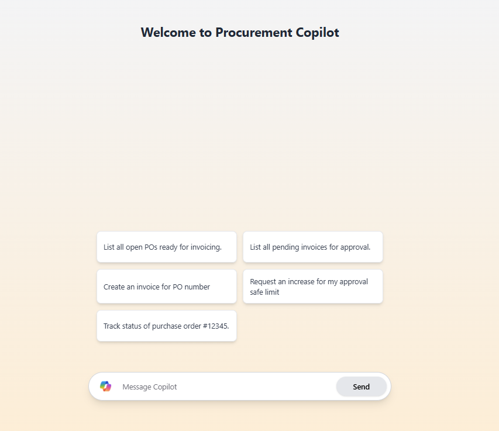

# Financial Procurement Agents System

This project implements a procurement process management system with intelligent agents handling different aspects of the procurement workflow. The system consists of multiple microservices and an agent-based interface for managing purchase orders, invoices, goods received, and approval workflows.



## Project Structure

The project is divided into three main parts:
1. **Agents** - A .NET application using Semantic Kernel with three specialized AI agents
2. **API Services** - Four independent microservices that manage different aspects of the procurement process
3. **UI** - A modern web interface for interacting with the procurement system

### Microservices Architecture
- **InvoiceAPI** - Manages invoice data and approval workflows
- **PurchaseOrderAPI** - Handles purchase order creation and status management
- **GoodReceivedAPI** - Tracks goods receipt against purchase orders
- **SafeLimitAPI** - Validates approval authority limits for financial transactions

## Prerequisites

- [.NET 8.0 SDK](https://dotnet.microsoft.com/download/dotnet/8.0)
- [Docker](https://www.docker.com/products/docker-desktop)
- Azure CLI (for authentication with Azure OpenAI service)

## Getting Started

### Running the APIs

The APIs can be run using Docker Compose:

1. Navigate to the API directory:
```
cd api
```

2. Build and start all API services with Docker Compose:
```
docker-compose build
docker-compose up -d
```

This will start all four microservices with the following endpoints:
- Invoice API: http://localhost:5136
- Goods Received API: http://localhost:5284
- Purchase Order API: http://localhost:5294
- Safe Limit API: http://localhost:5310

### Running the UI Application

1. Navigate to the UI directory:
```
cd ui
```

2. Install dependencies:
```
npm install
```

3. Start the development server:
```
npm run dev
```

4. Access the UI in your browser at: http://localhost:3000

### Running the Agents Application

The agents application uses Semantic Kernel and Azure OpenAI to provide an intelligent interface for interacting with the procurement system.

1. Navigate to the agents directory:
```
cd agents
```

2. Install dependencies and build the project:
```
dotnet build
```

3. Run the application:
```
dotnet run
```

4. The application will start a CLI interface where you can interact with the financial agents.

## Using the System

The system provides both a web UI and an intelligent agent interface that can:

1. **View and manage Purchase Orders**
   - Get details of specific purchase orders
   - Update purchase order statuses
   - List purchase orders filtered by status
   - Create new purchase orders with automated approvals

2. **Process Invoices**
   - View invoice details
   - Create new invoices with automated number generation
   - Create multiple invoices for the same purchase order
   - Approve invoices (with authorization verification)
   - List pending invoices

3. **Track Goods Received**
   - Update goods received status
   - Record serial numbers and asset tags
   - View goods received information by purchase order

### Example Interactions

```
User>>> Show me pending invoices

InvoiceAgent>>> Found 2 invoices pending approval:

Invoice #INV-2025-0001
Supplier: Office Supplies Inc.
Amount: $244.54
Due date: 2025-04-15
Authorized Approver: Sarah Johnson

Invoice #INV-2025-0004
Supplier: Catering Express
Amount: $1087.75
Due date: 2025-04-30
Authorized Approver: Emily Wilson
```

```
User>>> Approve invoice INV-2025-0001 by Sarah Johnson

InvoiceAgent>>> Invoice #INV-2025-0001 has been successfully approved by Sarah Johnson.
```

## Project Components

### API Endpoints

#### Invoice API
- GET /api/Invoices - Get all invoices
- GET /api/Invoices/{invoiceNumber} - Get invoice by number
- GET /api/Invoices/pending - Get pending invoices
- PUT /api/Invoices/{invoiceNumber}/approve - Approve an invoice
- POST /api/Invoices - Create a new invoice
- PUT /api/Invoices/{invoiceNumber}/status - Update invoice status

#### Purchase Order API
- GET /api/PurchaseOrders - Get all purchase orders
- GET /api/PurchaseOrders/{poNumber} - Get purchase order by number
- PUT /api/PurchaseOrders/{poNumber}/status - Update purchase order status

#### Goods Received API
- GET /api/GoodsReceived/po/{poNumber} - Get goods received for PO
- PUT /api/GoodsReceived/update - Update goods received status

#### Safe Limit API
- POST /api/SafeLimits/check - Check approval limit for a user

### Agents

The system uses three specialized AI agents:

1. **InvoiceAgent** - Manages invoice-related operations
2. **PurchaseOrderAgent** - Handles purchase order operations
3. **GoodReceivedAgent** - Manages goods receiving processes

The agents work together in an intelligent multi-agent system using Semantic Kernel to provide a natural language interface for working with the procurement process.

## Data Persistence

Each microservice manages its own data in JSON files:
- `/api/InvoiceAPI/data/invoices.json`
- `/api/PurchaseOrderAPI/data/purchase-orders.json`
- `/api/GoodReceivedAPI/data/gsr.json`
- `/api/SafeLimitAPI/data/safe-limits.json`

The Docker Compose configuration maps these files to volumes for persistence.

### Key Features

1. **Automated Invoice Number Generation**
   - System automatically generates unique invoice numbers using the format `INV-{date}-{random}` when creating invoices
   - Format ensures chronological tracking and uniqueness
   - Users can also provide their own invoice numbers if needed

2. **Multiple Invoices Per Purchase Order**
   - System supports creating multiple invoices for the same purchase order as long as the PO is open
   - This enables partial billing and installment payments scenarios
   - Proper validation prevents invoicing against closed purchase orders

3. **Comprehensive Approval Workflow**
   - Invoice approval checks for appropriate authorization levels
   - System verifies that goods have been received before allowing approval
   - Approval limits are enforced based on user roles and transaction amounts

4. **Modern Web Interface**
   - Responsive design with modern UI components
   - Real-time updates and notifications
   - Filter and search capabilities for all procurement documents
